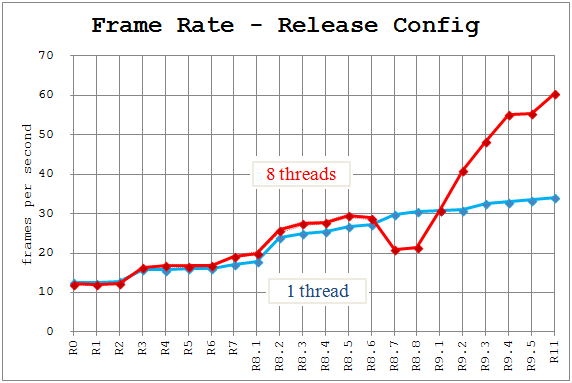

# Fast A-KAZE
This project optimizes Accelerated-KAZE feature detector and descriptor, written
by Pablo Fernandez Alcantarilla and Jesus Nuevo.

The software has been tested with:
  - Windows 7 SP1 (x64)
  - Visual Studio 2013
  - OpenCV 3.0 gold
  - Webcam Logicool C525

All changes are C++11 compliant, so the code is portable to the modern platforms.

Especially after Support_CentOS7 branch is merged, gcc 4.8.3 and gcc 4.9.2 (Devtoolset-3)
are tested to compile the code on CentOS7.1, using CMakeLists.txt.

## 1. Performance Improvement
The optimization consists of a series of incremental changes --- topics --- to the original code.

Here is the graph to show the speedup of each topic.

The total speedup achieved:
 - **270%** for a single thread run (12.6fps to 34.0fps)
 - **495%** for an eight-thread run (12.2fps to 60.4fps) --- **Full motion!!**

A bit of explanation:
 - R0 and R1 are the original code of OpenCV3
 - R2 to R7 involve global changes under some topics  e.g. reducing memory copies.
 - R8 is refactoring of heavy functions
 - R9 improves concurrency, in contrast that R2 to R8 focus on the speed of single thread
 - R11 optimizes convolution filter.

More information about details and design decisions are available in `perf_tests` directory.  
The commit logs are also good source of knowing the details.

## 2. Optimization policy
The changes are made very carefully such that they will not alter the original behavior
of AKAZE algorithm.

In addition, most commits have been made as much self-explanatory as possible, in hope that
the correctness of a change is immediately verified by anyone.

The optimization applies following well-known techniques:

 - Minimize memory copy and initialization --- such as zero-fills
 - Preallocate working memory --- to reduce the number of allocation & free
 - Morph the heavy loops into auto-vectorizer friendly loops --- to pull out more SIMD acceleration
 - Minimize cache traffic by accessing hot data timely
 - Reduce cv::Mat::ptr() by relying on the continuous memory layout of cv::Mat's data
 - Move invariants and conditionals out of the inner loops by simplifying control flow
 - Parallelize tasks --- task-based concurrency with minimum overhead

Some techniques are excluded by intention:

 - Platform dependent code --- such as CPU affinity, thread priority, intrinsics, pragmas, ...,etc.
 - Algorithm altering changes  --- such a change should first get into the original code

## 3. Test application
The project contains the test application --- a small program --- to measure
the performance of Fast A-KAZE code, for anyone who wishes to reproduce the test result.

### 3.1 Getting started
First, clone Fast A-KAZE repository and checkout the branch of concern.

        $ git clone https://github.com/h2suzuki/fast_akaze.git
        $ cd fast_akaze
        $ git checkout R11

Use Visual Studio 2013 to build and run the test application.

### 3.2 Dependencies

#### - OpenCV3
The project requires that OpenCV3 be installed on both the build environment and the test environment.

By default, this project assumes `CMAKE_INSTALL_PREFIX=C:/opencv` is defined when building OpenCV,
which means OpenCV3 is installed under `c:\opencv`.

The location can be changed by editing Visual Studio property sheets in `fast_akaze\fast_akaze` directory

| Property Sheets | Element | Value to change | Remarks |
|----------------------|--------------|-----------|--------------|
| opencv300.props | AdditionalIncludeDirectories | `C:\opencv\include` | The path to the include files|
| opencv300.props | AdditionalLibraryDirectories | `$(OPENCV_DIR)\lib` | The path to the library files|
| opencv300_x64debug.props | AdditionalDependencies | `opencv_calib3d300d.lib;...(omit)` | Debug DLL names to link |
| opencv300_x64release.props | AdditionalDependencies | `opencv_calib3d300.lib;...(omit)` | Release DLL names to link |

Also, the environment variable `OPENCV_DIR` must be set such as `C:\opencv\x64\vc12`.

##### \[OpenCV3 Prebuilt Binary\]

If you have a prebuilt binary, you can unzip the binary, and move its `build` directory to `C:\opencv` so that
`C:\opencv\x64\vc12` can be found.

The project file and the property sheets are provided to work with the prebuilt binary.

| Property Sheets      |  Remarks |
|----------------------|--------------|
| prebuilt_fast_akaze.vcxproj | The project file referring prebuilt_opencv300*.props |
| prebuilt_opencv300.props | `$(OPENCV_DIR)\staticlib` is added to the dependencies |
| prebuilt_opencv300_x64debug.props | `opencv_world300d.lib` and `opencv_hal300d.lib` are referred |
| prebuilt_opencv300_x64release.props | `opencv_world300.lib` and `opencv_hal300.lib` are referred |

Replace `fast_akaze.vcxproj` with `prebuilt_fast_akaze.vcxproj`, so these files can take effect.

Note that the prebuilt binary provides the all-in-one library file `opencv_world300.lib`, but this file does not
contain DLL version of `opencv_hal300.lib`(yet?).  To workaround this issue, the project will compile
a static version of the application by this project file.

#### - Webcam
The test environment must have a webcam to feed the video stream to Fast A-KAZE.

The webcam and the light source can affect the performance of video capturing very much.
If you set `ALLOW_OVERPACE` to false (described later), the test result may show only
the video capturing performance instead of the performance of A-KAZE feature detector.

### 3.3 Run

  1. Open the solution file `fast_akaze.sln`
  2. Select the target configuration; either Debug or Release
  3. Build by F6
  3. Run the generated executable by F5 (with debugger) or Ctrl-F5 (without debugger).

For recent versions, CMakeLists.txt is also available to compile the code with gcc.

### 3.4 Tweaking
The following macros are available in `main.c` for your experiments.

| Macro | Description |
|-------|-------------|
| USE_AKAZE2 | **0** to use A-KAZE contained by OpenCV3; **1** to use Fast A-KAZE |
| OPENCV_THREAD_COUNT | The value for cv::setNumThreads() |
| ALLOW_OVERPACE | **true** to run akaze thread independently from video capturing thread; **false** to make akaze thread wait till new frame arrives to process |
| VIDEO_FRAME_WIDTH | Webcam setting by VideoCapture::set() |
| VIDEO_FRAME_HEIGHT | Webcam setting by VideoCapture::set() |
| VIDEO_FRAME_FPS | Webcam setting by VideoCapture::set() |
| AKAZE_DESCRIPTOR_SIZE | The parameter of cv::AKAZE::create() |
| AKAZE_DESCRIPTOR_CH | The parameter of cv::AKAZE::create() |
| AKAZE_NUM_OCTAVES | The parameter of cv::AKAZE::create() |
| AKAZE_NUM_OCTAVE_SUBLAYERS | The parameter of cv::AKAZE::create() |
| AKAZE_KPCOUNT_MIN | The lower bound for the target number of keypoints |
| AKAZE_KPCOUNT_MAX | The upper bound for the target number of keypoints |
| AKAZE_THRESHOLD_MIN | The allowed minimum threshold of keypoint detection |
| AKAZE_THRESHOLD_MAX | The allowed maximum threshold of keypoint detection |
| MATCH_HAMMING_RADIUS | The threshold to reject a matched keypoint as outliers |

## 4. Bug fixes
The project contains a few bug fixes to the original code, though nothing is severe.
The fixes can be searched by keyword "Fix" in the commit log.

## 5. License
This project is provided under "3-clause BSD" license, which is the same as the original license of AKAZE.

## 6. Contact Info
If you have a question, or you want to share some improvements or bug fixes of my code, you can contact me through e-mail:

    Hideaki Suzuki (h2suzuki at gmail.com)

For questions and changes to the original code, please contact the author of A-KAZE.

## 7. References
 - [Accelerated-KAZE Feature](http://www.robesafe.com/personal/pablo.alcantarilla/kaze.html) --- [pablofdezalc/akaze @Github](http://github/pablofdezalc/akaze)
 - [OpenCV](http://opencv.org/) --- [Itseez/opencv @Github](http://github.com/Itseez/opencv)

Happy hacking! :smile:

